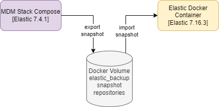
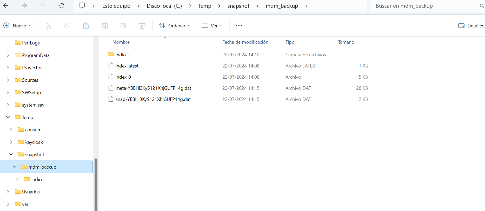

# Description

PoC About export/import snaphosts between MDM Elastic 7.4.2 to Elastic 7.16.3  We will detail all steps to execute this PoC.

This diagram represent the services and volumes used to export/import snapshots between different elastic search versions:



## STEP01: Start MDM Stack with elastic 7.4.2 service

Download the repo: https://github.com/masalinas/poc-mdm-haproxy-oauth2 to start the MDM services and the Elastic 7.4.2 with all MDM indices
to be exported

```
$ docker compose up -d --no-deps --build
```

## STEP02: List elastic indices

We can list the original MDM indices to be exported executing this REST API endpoint

```
GET http://localhost:9200/_cat/indices?v=true&s=index
```

## STEP03: Create a respository for your snapshots

Execute this REST API endpoint to create a new repository for your snapshots. The values to include in this request are:

- The repository name: my-mdm_backup
- The location where save the snapshots relative to the folder set in **path.repo** elastic environment variable: mdm_backup

```
PUT http://localhost:9200/_snapshot/my-mdm_backup
{
  "type": "fs",
  "settings": {
    "location": "mdm_backup"
  }
}
```

## STEP4: Create a snapshot

Create manually a snaphost of your elastic instance passing the repository where save this snaphot and the unique name for this snapshot to be created

```
PUT http://localhost:9200/_snapshot/my-mdm_backup/my_snapshot_20240719154610
```

## STEP05: Start new elasticsearch

After creating a snaphot for our MDM Elastic service, now we are going to start another new Elastic service to import the previous snaphots.

We must set this configuration

- Select a unique name for this service: consum-elasticsearch-new
- Select a new port for this service: 9201
- Add **path.repo** environment variable with a folder where recover the snapshots: /usr/share/elasticsearch/backup
- Attach the volumen used with the MDM Stack to share its snapshots with this service: poc-haproxy-oauth2_elastic_backup

```
$ docker run -d \
--name consum-elasticsearch-new \
-p 9201:9200 -p 9300:9300 \
-e "discovery.type=single-node" \
-e "path.repo=/usr/share/elasticsearch/backup" \
--volume poc-haproxy-oauth2_elastic_backup:/usr/share/elasticsearch/backup \
--net consum \
elasticsearch:7.16.3
```

## STEP06: List elastic indices

List the indices of the new ElasticSearch to check the original indices previous the snapshot import step

```
GET http://localhost:9201/_cat/indices?v=true&s=index
```

## STEP07: Create a respository for your snapshots

Execute this REST API endpoint to create a repository for your snapshots. We can select the same name or different fot this repository. The must important is **select the same location used previous in the MDM service where the snapshots are saved** where the snapshots are saved

```
PUT http://localhost:9201/_snapshot/my-mdm_backup
{
  "type": "fs",
  "settings": {
    "location": "mdm_backup"
  }
}
```

## STEP08:  List the snapshot repositories

List the repositories created for this service

```
GET http://localhost:9201/_snapshot
```


## STEP09:  List the snapshots inside the repositories

List the snapshot repositories created for this service. We will see all share snapshots created for the MDM service

```
GET http://localhost:9201/_snapshot/my-mdm_backup/*?verbose=false
```

## STEP10:  Restore a snapshot

We will select one snapshot to be import from the previous list

```
POST http://localhost:9201/_snapshot/my-mdm_backup/my_snapshot_20240719154610/_restore
```

## STEP11: List new indices imported

List again the new indices created. We will see all MDM Elastic indices with the same data:

```
GET http://localhost:9201/_cat/indices?v=true&s=index
```

## Arrancar nuevo elastic con nuevos indices

To start the new elastic we must:

- Redudce the consume of RAM memory to 2G: "ES_JAVA_OPTS=-Xms2g -Xmx2g"
- Create a Bind mount to attached the snapshot folder to the default repository snapshot folder of the elastic service: /mnt/c/Temp/snapshot:/usr/share/elasticsearch/backup. **We must to know that the subfolder inside this snapshot folfer must be named as mdm_backup, because it will be the location when we create the repository snapshot in our new elastic service**

```
docker run -d \
--name consum-elasticsearch-new \
-p 9201:9200 \
-e "discovery.type=single-node" \
-e "path.repo=/usr/share/elasticsearch/backup" \
-e "ES_JAVA_OPTS=-Xms2g -Xmx2g" \
--volume /mnt/c/Temp/snapshot:/usr/share/elasticsearch/backup \
--net consum \
elasticsearch:7.16.3
```



- [Snapshot Restore Version Compatibility](https://www.elastic.co/guide/en/elasticsearch/reference/8.14/snapshot-restore.html#snapshot-restore-version-compatibility)

## Links

- [Snapshot Restore Version Compatibility](https://www.elastic.co/guide/en/elasticsearch/reference/8.14/snapshot-restore.html#snapshot-restore-version-compatibility)
